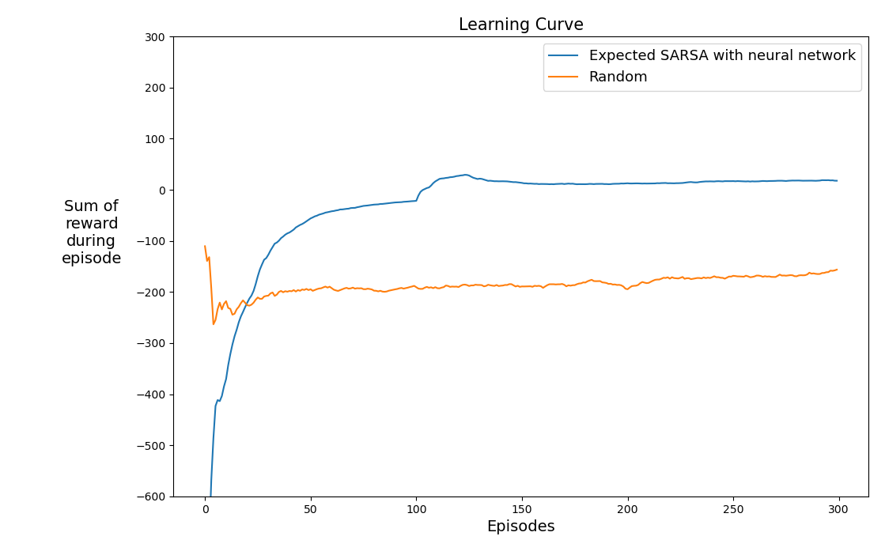

Lunar Lander with Expected SARSA
Python implementation of the Expected SARSA Reinforcement Learning algorithm applied to the Lunar Lander environment from OpenAI Gym.

🚀 Overview
This repository contains code that demonstrates how Expected SARSA, an on-policy reinforcement learning algorithm, can solve the challenging Lunar Lander environment.

📁 Project Structure
src/: Core Python scripts and RL implementation
config/: YAML configuration files for hyperparameters
utils/: Helper functions and utilities
data/: Directory to store experimental data
results/: Experiment results and plots

🛠️ Installation
pip install -r requirements.txt

▶️ How to Run
python main_run_experiment.py

📊 Results
Generated plots and experiment results are stored under the results/ directory.

📝 Dependencies
requirements.txt
